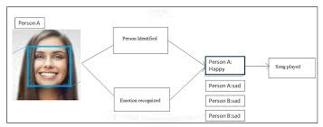
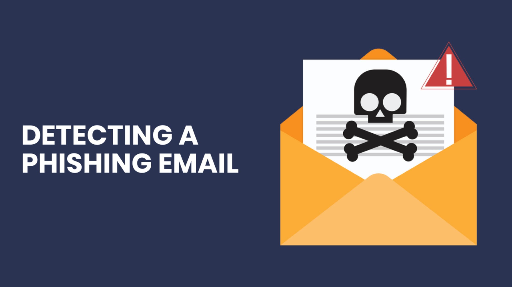

<!-- Stylish GitHub Profile README -->

<!-- Typing SVG Banner -->

  

---

## 🚀 About Me  
🔹 **Data Scientist & Cybersecurity Enthusiast** with expertise in building intelligent solutions, securing systems, and making sense of complex data.  
🔹 Skilled in **Machine Learning, AI, NLP, Data Visualization, and Security Analytics**.  
🔹 Passionate about **turning raw data into actionable insights** and protecting digital assets.

---

## 🛠️ Skills & Tools

### **Languages**

### **Data Science & AI**

### **Machine Learning**

### **Visualization Tools**

### **Cybersecurity**

---

## 📂 Featured Projects  

### 🔹 Emotion-Based Song Recommendation System 🎵  
An AI-powered system that detects emotions via facial recognition and recommends songs using **Spotify & YouTube APIs**.  
[🔗 View Project](https://github.com/THeOLdMAn48/Emotion-Based-Song-Recommendation-V.2.0)

### 🔹 Phishing Email Detection with Visualization 📧  
Built a **machine learning model** to detect phishing emails with interactive data visualization using **Seaborn & Matplotlib**.  
[🔗 View Project](https://github.com/THeOLdMAn48/PCAP-Malware-Traffic-Analysis-)

### 🔹 Sales Forecasting Dashboard 📊  
Interactive **Streamlit + Prophet + Plotly** app for predicting sales trends with downloadable reports.  
[🔗 View Project](https://github.com/THeOLdMAn48/sales-forecasting-dashboard)

---

## 📊 GitHub Stats  

  
  

  

---

## 📫 Connect With Me  

---

⭐️ From [THeOLdMAn48](https://github.com/THeOLdMAn48)
